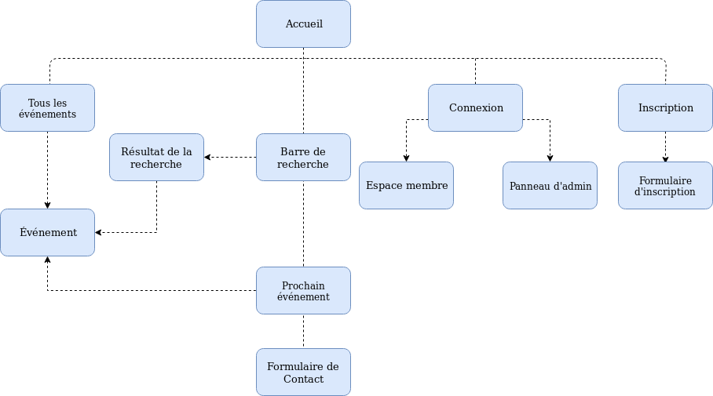
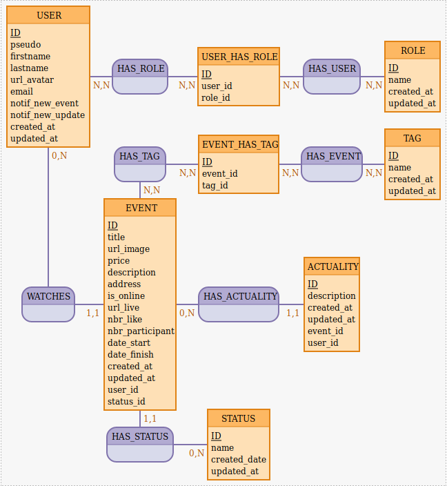

# Projet Event Listener

c'est le début mais on est chaud bouillant ! =D 

## Liens :

Google Drive. 
-> https://drive.google.com/drive/folders/10hzqNPelAM3UF2mvsa1fHGnqWUyh9rgB

Trello.
-> https://trello.com/b/B5jzEjFq/event-listener

*****************************************

## Arborescence :

Voici l'Arborescence de notre projet.

## Mocodo 
USER: ID, pseudo, firstname, lastname, url_avatar, email, notif_new_event, notif_new_update, created_date, updated_date
HAS_ROLE, NN USER_HAS_ROLE, NN USER
USER_HAS_ROLE: ID, user_id, role_id
HAS_USER, NN ROLE, NN USER_HAS_ROLE
ROLE: ID, name, created_date, updated_date

:
HAS_TAG, NN EVENT, NN EVENT_HAS_TAG
EVENT_HAS_TAG: ID, event_id, tag_id
HAS_EVENT, NN EVENT_HAS_TAG, NN TAG
TAG: ID, name, created_date, updated_date

POSSESS, 0N USER, 11 EVENT
EVENT: ID, title, url_image, price, description, address, is_online, url_live, nbr_like, nbr_participant, date_start, date_finish, created_date, updated_date, user_id, status_id
HAS_ACTUALITY, 0N EVENT, 11 ACTUALITY
ACTUALITY: ID, description, created_date, updated_date, event_id, user_id

HAS_STATUS, 11 EVENT, 0N STATUS
STATUS: ID, name, created_date, updated_date

*****************************************
*****************************************

## /!\ AIDE -> GitHub 

### Gestion des fichiers

- `git add [filename]` : ajoute les modifications faites dans le fichier à l'index
- `git add .`, _alias, technique du bourrin_ : ajoute les modifs de tous les fichiers dans le dossier  
/!\ à n'utiliser si on est sûr de n'avoir fait QUE des modifs liées au commit en cours !
- `git reset HEAD` : annule les `add` déjà faits
- `git commit [-m "message de commit"]` : enregistre les modifs indexées dans le commit
- `git push` : envoie tous les commits locaux sur le repo  
- `git pull` : récupère en local un projet depuis le repo, pour un projet déjà en cours (au contraire de clone qu'on utiliser uniquement pour un nouveau projet)  
- `git rm --cached <file(s)>` : **supprimer des fichiers suivis du repo** qui auraient été ajoutés par erreur OU **ajoutés dans le .gitignore par la suite** (ne supprime pas le fichier lui-même en local, bien entendu, uniquement dans le dépôt).

### Vérifier l'état courant du repo local

- `git status` : récapitule l'état local (workspace et index) des fichiers du projet géré avec Git
  - En rouge : modifié mais non pris en compte (= en workspace)  
  - En vert : modifié et pris en compte (= ajouté à l'index)

### Branches

- `git branch nomDeLaBranche` : crée une nouvelle branche (nouvelle version du projet) identique à la version HEAD - permet de tester des développements (réparer un bug, expérimenter une nouvelle fonctionnalité...) et commiter sans affecter la branche principale
- `git checkout nomDeLaBranche` : bascule sur la branche nomDeLaBranche
- :bulb: `git checkout -b nomDeLaBranche` : permet de réaliser les deux opérations du dessus (création de la branche & migration sur celle-ci)
- Tu envoies tes modifications sur le remote `origin`, sur GitHub. Ou tout du moins tu essayes :
    1. Non, ça ne va pas fonctionner tout de suite ! Eh oui, ta nouvelle branche n'existe pas sur le remote `origin`…
    2. mais **git** est intelligent et te donne la ligne de commande à exécuter pour créer la branche distante sur `origin` et faire un _push_ qui fonctionne !
- `git merge nomDeLaBranche` : rattache ma branche au master de la branche principale (master) ==> nécessite de résoudre les conflits !

Pour un dossier de travail donné, Git manipule différents « espaces virtuels » :

- **_Workspace_** : espace stockant les modifications en cours, **qui ne sont pas (encore) prises en compte** par Git.
- **_Index (ou stage)_** : espace stockant les modifications en cours, **qui seront prises en compte par Git pour le prochain commit (mais pas encore commitées)**.
- **_Local repository_** : espace stockant les modifications **déjà prises en compte par Git**.
- **_Remote repository_** : désigne le dépôt distant (_remote_, sur GitHub par exemple), dépôt auquel est relié votre dépôt local. **Les commits du _local repository_ doivent y être pushés pour mettre le dépôt distant à jour** et collaborer avec d'autres personnes.
